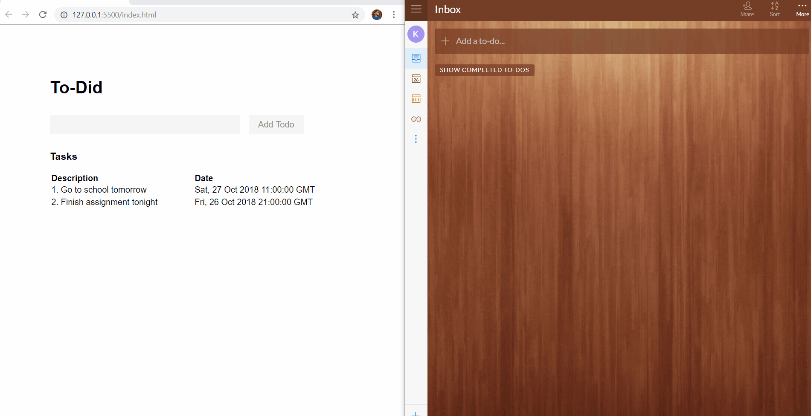

# To-Did
Wunderlist, the to-do-list app, had a date parsing feature which it used to extract due dates for tasks. Over a weekend, I built a similar mechanic with my friend [Ekiyor](https://github.com/ekiyorodoko). 

### Demo

